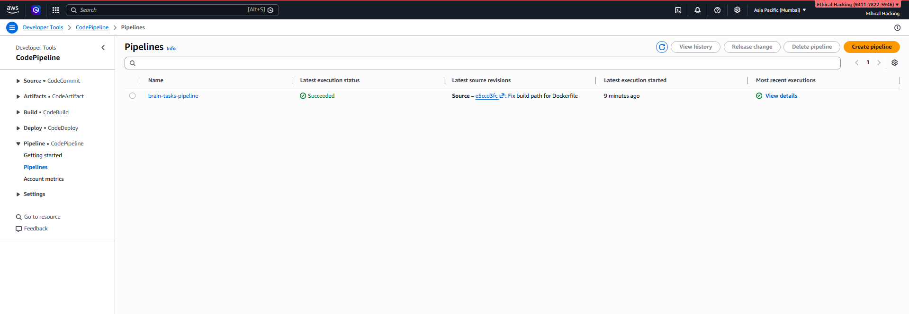
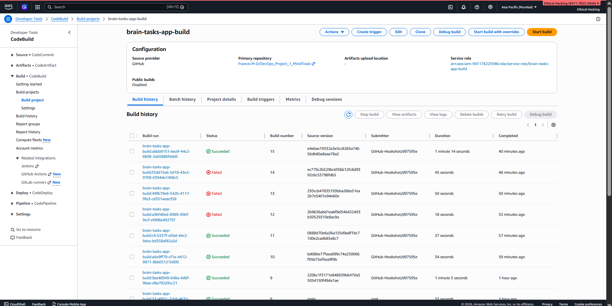
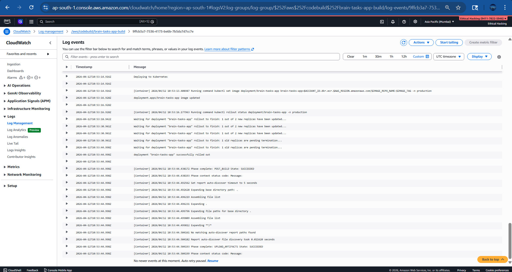
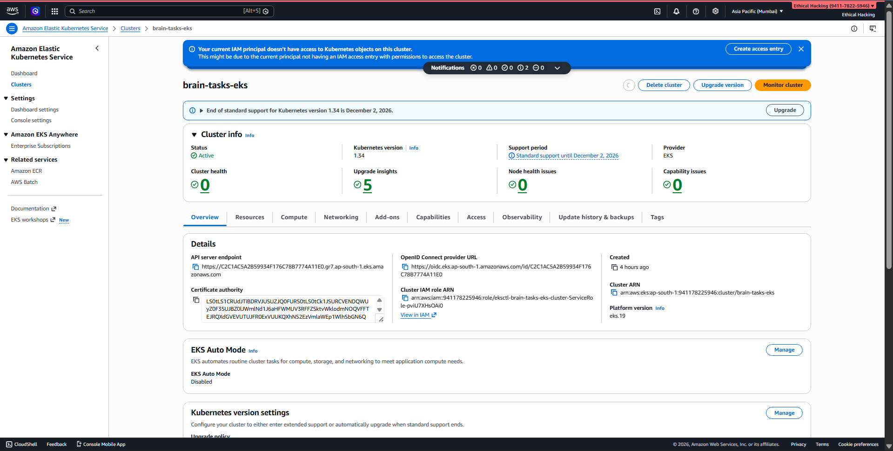
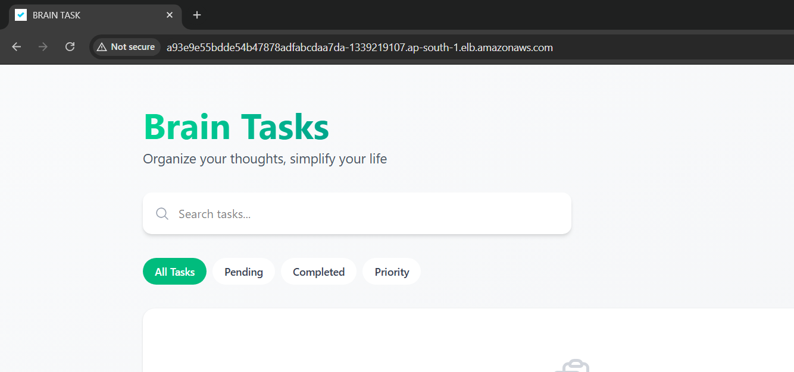

```markdown
# 🚀 DevOps Project 1 – MindTrack CI/CD Pipeline

---

## 📌 Project Overview

This project demonstrates a **production-ready CI/CD pipeline** that automates the deployment of a containerized frontend application to Kubernetes on AWS.

The pipeline is fully automated:

👉 **Git Push → CodePipeline → CodeBuild → Docker → ECR → EKS → Live Deployment**

---

## 📁 Project Structure

```

DevOps_Project_1_MindTrack$ tree
├── Brain-Tasks-App
│   ├── Dockerfile
│   ├── README.md
│   ├── buildspec.yml
│   ├── dist
│   │   ├── assets
│   │   │   ├── index-BHGiHu50.js
│   │   │   └── index-DPTLVrPB.css
│   │   ├── index.html
│   │   └── vite.svg
│   ├── iam-policy.json
│   ├── k8s
│   │   ├── deployment.yaml
│   │   └── service.yaml
│   ├── nginx.conf
│   └── scripts
│       ├── eks-setup.sh
│       └── monitoring-setup.sh
└── README.md

````

---

## 🧰 Tech Stack

- GitHub (Source Code + Webhook)
- AWS CodePipeline (Pipeline Orchestration)
- AWS CodeBuild (Build & Deploy)
- Amazon ECR (Container Registry)
- Amazon EKS (Kubernetes)
- Docker
- kubectl
- nginx

---

## ⚙️ Application Setup

- Frontend built using Vite/React
- Production build output: `/dist`
- Static files served using Nginx container

---

## 🐳 Docker Setup

### Build Docker Image Locally

```bash
cd Brain-Tasks-App
docker build -t brain-tasks-app .
docker run -d -p 3000:3000 brain-tasks-app
````

Open:

```
http://<your-server-ip>:3000
```

---

## 📦 Amazon ECR Setup

### Login to ECR

```bash
aws ecr get-login-password --region ap-south-1 | docker login --username AWS --password-stdin <account-id>.dkr.ecr.ap-south-1.amazonaws.com
```

### Tag & Push Image

```bash
docker tag brain-tasks-app:latest <account-id>.dkr.ecr.ap-south-1.amazonaws.com/brain-tasks-app:latest
docker push <account-id>.dkr.ecr.ap-south-1.amazonaws.com/brain-tasks-app:latest
```

---

## ☸️ Amazon EKS Setup

### Create Cluster

```bash
eksctl create cluster --name brain-tasks-eks --region ap-south-1
```

### Configure kubectl

```bash
aws eks update-kubeconfig --region ap-south-1 --name brain-tasks-eks
```

---

## 📦 Kubernetes Deployment

### Create Namespace

```bash
kubectl create namespace production
```

### Apply Configurations

```bash
kubectl apply -f k8s/deployment.yaml
kubectl apply -f k8s/service.yaml
```

---

### Verify Deployment

```bash
kubectl get pods -n production
kubectl get svc -n production
```

---

## 🌐 Access Application

```bash
kubectl get svc -n production
```

Open:

```
http://<load-balancer-url>
```

---

## 🔐 IAM & RBAC Configuration

Add CodeBuild role to `aws-auth`:

```yaml
- rolearn: <CODEBUILD_ROLE_ARN>
  username: codebuild
  groups:
    - system:masters
```

### Verify Access

```bash
kubectl auth can-i get deployments -n production --as=codebuild
```

---

## 🏗️ CI/CD Pipeline

### Pipeline Flow

1. Code pushed to GitHub
2. Webhook triggers CodePipeline
3. CodePipeline triggers CodeBuild
4. Docker image is built
5. Image pushed to ECR
6. Kubernetes deployment updated in EKS
7. New version goes live

---

## 📜 buildspec.yml Workflow

* Authenticate to ECR
* Build Docker image
* Tag with timestamp
* Push to ECR
* Update Kubernetes deployment
* Monitor rollout

---

## 🔔 Automation

* GitHub webhook triggers pipeline automatically
* No manual intervention required

---

## 📊 Monitoring

### Build Logs

* Available in CloudWatch
* Tracks Docker build and deployment steps

---

### Kubernetes Logs

```bash
kubectl logs <pod-name> -n production
```

---

## 🧪 Final Testing

1. Make code changes
2. Push to GitHub

### Expected Outcome:

```
✔ Pipeline triggers automatically
✔ Build completes successfully
✔ New image pushed to ECR
✔ Pods updated in EKS
✔ Changes visible in browser
```

---

## 📸 Screenshots

### 🔹 CodePipeline Success



### 🔹 CodeBuild Success



### 🔹 CloudWatch Logs



### 🔹 Pods Running



### 🔹 Application Live



---

## 🌍 Live Application

```
http://<your-load-balancer-url>
```

---

## 🧹 Cleanup

To avoid AWS charges:

```bash
eksctl delete cluster --name brain-tasks-eks --region ap-south-1
```

Also delete:

* ECR repository
* CodeBuild project
* CodePipeline pipeline
* CloudWatch logs

---

## 👨‍💻 Author

**MARIA FRANCIS D**

---

## 🎯 Outcome

```
GitHub → CodePipeline → CodeBuild → Docker → ECR → EKS → Live App
```

Fully automated, scalable, and production-ready 🚀

```
```

